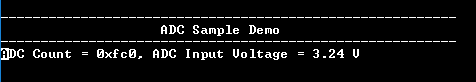

# ADCHS Interrupt

This example application shows how to sample an analog input using the ADCHS peripheral and displays the converted samples on a serial terminal.

## Description

In this application, an analog input is converted by a hardware trigger generated by the TMR peripheral. Result is read in the conversion complete interrupt handler. Converted digital value is displayed on the serial terminal.

## Downloading and building the application

To download or clone this application from Github, go to the [top level of the repository](https://github.com/Microchip-MPLAB-Harmony/csp_apps_pic32mz_da) and click

Path of the application within the repository is **apps/adchs/adchs_interrupt/firmware** .

To build the application, refer to the following table and open the project using its IDE.

| Project Name      | Description                                    |
| ----------------- | ---------------------------------------------- |
| pic32mz_dag_sk.X | MPLABX project for [PIC32MZ Embedded Graphics with Stacked DRAM (DA) Starter Kit](https://www.microchip.com/DevelopmentTools/ProductDetails/PartNO/DM320010)     |
| pic32mz_das_sk.X | MPLABX project for [PIC32MZ Embedded Graphics with Stacked DRAM (DA) Starter Kit (Crypto)](https://www.microchip.com/DevelopmentTools/ProductDetails/DM320010-C) |
|||

## Setting up the hardware

The following table shows the target hardware for the application projects.

| Project Name| Board|
|:---------|:---------:|
| pic32mz_dag_sk.X | [PIC32MZ Embedded Graphics with Stacked DRAM (DA) Starter Kit](https://www.microchip.com/DevelopmentTools/ProductDetails/PartNO/DM320010)     |
| pic32mz_das_sk.X | [PIC32MZ Embedded Graphics with Stacked DRAM (DA) Starter Kit (Crypto)](https://www.microchip.com/DevelopmentTools/ProductDetails/DM320010-C) |
|||

### Setting up [PIC32MZ Embedded Graphics with Stacked DRAM (DA) Starter Kit](https://www.microchip.com/DevelopmentTools/ProductDetails/PartNO/DM320010)

- Connect the AN3 pin RB15 (Pin 36 of the J15) to the Vcc (Pin 1 of the J15)
- Connect the COM port J5(UART-USB) to the computer using a micro USB cable
- Connect the Debug USB port on the board to the computer using a micro USB cable

### Setting up [PIC32MZ Embedded Graphics with Stacked DRAM (DA) Starter Kit (Crypto)](https://www.microchip.com/DevelopmentTools/ProductDetails/DM320010-C)

- Connect the AN3 pin RB15 (Pin 36 of the J15) to the Vcc (Pin 1 of the J15)
- Connect the COM port J5(UART-USB) to the computer using a micro USB cable
- Connect the Debug USB port on the board to the computer using a micro USB cable

## Running the Application

1. Open the Terminal application (Ex.:Tera term) on the computer
2. Connect to the "USB to UART" COM port and configure the serial settings as follows:
    - Baud : 115200
    - Data : 8 Bits
    - Parity : None
    - Stop : 1 Bit
    - Flow Control : None
3. Build and Program the application project using its IDE
4. Console displays the ADC count and the ADC input voltage

