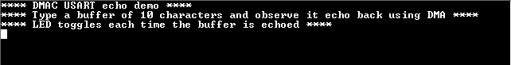

# DMAC usart echo

This example application demonstrates USART transfer with DMA to receive 10 bytes and echo back the received bytes

## Description

This application demonstrates USART transfer with DMA using SERCOM peripheral configured in USART mode. One DMA channel is used to receive 10 bytes of data from the USART and another DMA channel is used to echo back the received bytes.

## Downloading and building the application

To download or clone this application from Github, go to the [top level of the repository](https://github.com/Microchip-MPLAB-Harmony/csp_apps_pic32mz_da) and click

Path of the application within the repository is **apps/dmac/dmac_usart_echo/firmware** .

To build the application, refer to the following table and open the project using its IDE.

| Project Name      | Description                                    |
| ----------------- | ---------------------------------------------- |
| pic32mz_dag_sk.X | MPLABX project for [PIC32MZ Embedded Graphics with Stacked DRAM (DA) Starter Kit](https://www.microchip.com/DevelopmentTools/ProductDetails/PartNO/DM320010)     |
| pic32mz_das_sk.X | MPLABX project for [PIC32MZ Embedded Graphics with Stacked DRAM (DA) Starter Kit (Crypto)](https://www.microchip.com/DevelopmentTools/ProductDetails/DM320010-C) |
|||

## Setting up the hardware

The following table shows the target hardware for the application projects.

| Project Name| Board|
|:---------|:---------:|
| pic32mz_dag_sk.X | [PIC32MZ Embedded Graphics with Stacked DRAM (DA) Starter Kit](https://www.microchip.com/DevelopmentTools/ProductDetails/PartNO/DM320010)     |
| pic32mz_das_sk.X | [PIC32MZ Embedded Graphics with Stacked DRAM (DA) Starter Kit (Crypto)](https://www.microchip.com/DevelopmentTools/ProductDetails/DM320010-C) |
|||

### Setting up [PIC32MZ Embedded Graphics with Stacked DRAM (DA) Starter Kit](https://www.microchip.com/DevelopmentTools/ProductDetails/PartNO/DM320010)

- Connect the Debug USB port on the board to the computer using a micro USB cable
- Connect the USB to UART port on the board to the computer using a micro USB cable

### Setting up [PIC32MZ Embedded Graphics with Stacked DRAM (DA) Starter Kit (Crypto)](https://www.microchip.com/DevelopmentTools/ProductDetails/DM320010-C)

- Connect the Debug USB port on the board to the computer using a micro USB cable
- Connect the USB to UART port on the board to the computer using a micro USB cable

## Running the Application

1. Open the Terminal application (Ex.:Tera term) on the computer
2. Connect to the "USB to UART" COM port and configure the serial settings as follows:
    - Baud : 115200
    - Data : 8 Bits
    - Parity : None
    - Stop : 1 Bit
    - Flow Control : None
3. Build and Program the application project using its IDE
4. Following message is output on console:

   

5. Type 10 characters in the terminal. It will echo back the received bytes and toggles the LED

The following table provides the LED name:

| Board      | LED Name |
| ---------- |--------- |
| [PIC32MZ Embedded Graphics with Stacked DRAM (DA) Starter Kit](https://www.microchip.com/DevelopmentTools/ProductDetails/PartNO/DM320010) | LED1 |
| [PIC32MZ Embedded Graphics with Stacked DRAM (DA) Starter Kit (Crypto)](https://www.microchip.com/DevelopmentTools/ProductDetails/DM320010-C) | LED1 |
|||