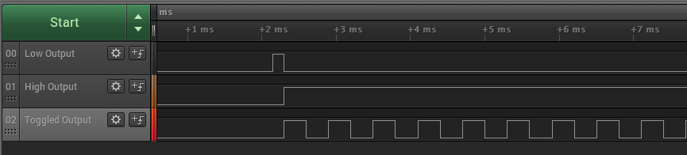

# OCMP compare mode

This example application shows how to use the OCMP peripheral to generate an active low, active high, and toggle output on compare match.

## Description

In this application, three OCMP modules are used to generate waveforms.

**Active Low Output**: By default output is set as high and it is set as low on the compare match

**Active High Output**: By default output is set as low and it is set as high on the compare match

**Toggled Output**: Compare match toggles the output

## Downloading and building the application

To download or clone this application from Github, go to the [top level of the repository](https://github.com/Microchip-MPLAB-Harmony/csp_apps_pic32mz_da) and click

Path of the application within the repository is **apps/ocmp/ocmp_compare_mode/firmware** .

To build the application, refer to the following table and open the project using its IDE.

| Project Name      | Description                                    |
| ----------------- | ---------------------------------------------- |
| pic32mz_dag_sk.X | MPLABX project for [PIC32MZ Embedded Graphics with Stacked DRAM (DA) Starter Kit](https://www.microchip.com/DevelopmentTools/ProductDetails/PartNO/DM320010)     |
| pic32mz_das_sk.X | MPLABX project for [PIC32MZ Embedded Graphics with Stacked DRAM (DA) Starter Kit (Crypto)](https://www.microchip.com/DevelopmentTools/ProductDetails/DM320010-C) |
|||

## Setting up the hardware

The following table shows the target hardware for the application projects.

| Project Name| Board|
|:---------|:---------:|
| pic32mz_dag_sk.X | [PIC32MZ Embedded Graphics with Stacked DRAM (DA) Starter Kit](https://www.microchip.com/DevelopmentTools/ProductDetails/PartNO/DM320010)     |
| pic32mz_das_sk.X | [PIC32MZ Embedded Graphics with Stacked DRAM (DA) Starter Kit (Crypto)](https://www.microchip.com/DevelopmentTools/ProductDetails/DM320010-C) |
|||

### Setting up [PIC32MZ Embedded Graphics with Stacked DRAM (DA) Starter Kit](https://www.microchip.com/DevelopmentTools/ProductDetails/PartNO/DM320010)

- Connect the Debug USB port on the board to the computer using a micro USB cable

### Setting up [PIC32MZ Embedded Graphics with Stacked DRAM (DA) Starter Kit (Crypto)](https://www.microchip.com/DevelopmentTools/ProductDetails/DM320010-C)

- Connect the Debug USB port on the board to the computer using a micro USB cable

## Running the Application

1. Build and program the application project using its IDE
2. Observe active low, active high and toggle output on the oscilloscope

    

3. Refer the following table for pin details:

    | OCMP output | [PIC32MZ Embedded Graphics with Stacked DRAM (DA) Starter Kit](https://www.microchip.com/DevelopmentTools/ProductDetails/PartNO/DM320010) pins | [PIC32MZ Embedded Graphics with Stacked DRAM (DA) Starter Kit (Crypto)](https://www.microchip.com/DevelopmentTools/ProductDetails/DM320010-C) pins |
    | ---- | ----- | ----- |
    | OC1 output | RD0 (Pin 24 of J15) | RD0 (Pin 24 of J15) |
    | OC2 output | RB2 (Pin 27 of J15) | RB2 (Pin 27 of J15) |
    | OC3 output | RD14 (Pin 26 of J15) | RD14 (Pin 26 of J15) |
    |||