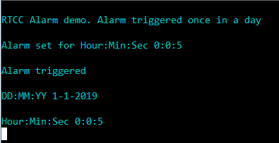

# RTCC alarm interrupt

This example application shows how to use the RTCC to configure the time and generate the alarm.

## Description

This example application shows how to setup RTCC time and configure alarm using the RTCC Peripheral Library. The application sets up an alarm to be generated every day at a specified time. A message is sent via the Virtual COM port on the alarm trigger.

## Downloading and building the application

To download or clone this application from Github, go to the [top level of the repository](https://github.com/Microchip-MPLAB-Harmony/csp_apps_pic32mz_da) and click

Path of the application within the repository is **apps/rtcc/rtcc_alarm/firmware** .

To build the application, refer to the following table and open the project using its IDE.

| Project Name      | Description                                    |
| ----------------- | ---------------------------------------------- |
| pic32mz_dag_sk.X | MPLABX project for [PIC32MZ Embedded Graphics with Stacked DRAM (DA) Starter Kit](https://www.microchip.com/DevelopmentTools/ProductDetails/PartNO/DM320010)     |
| pic32mz_das_sk.X | MPLABX project for [PIC32MZ Embedded Graphics with Stacked DRAM (DA) Starter Kit (Crypto)](https://www.microchip.com/DevelopmentTools/ProductDetails/DM320010-C) |
|||

## Setting up the hardware

The following table shows the target hardware for the application projects.

| Project Name| Board|
|:---------|:---------:|
| pic32mz_dag_sk.X | [PIC32MZ Embedded Graphics with Stacked DRAM (DA) Starter Kit](https://www.microchip.com/DevelopmentTools/ProductDetails/PartNO/DM320010)     |
| pic32mz_das_sk.X | [PIC32MZ Embedded Graphics with Stacked DRAM (DA) Starter Kit (Crypto)](https://www.microchip.com/DevelopmentTools/ProductDetails/DM320010-C) |
|||

### Setting up [PIC32MZ Embedded Graphics with Stacked DRAM (DA) Starter Kit](https://www.microchip.com/DevelopmentTools/ProductDetails/PartNO/DM320010)

- Connect the Debug USB port on the board to the computer using a micro USB cable
- Connect the USB to UART port on the board to the computer using a micro USB cable

### Setting up [PIC32MZ Embedded Graphics with Stacked DRAM (DA) Starter Kit (Crypto)](https://www.microchip.com/DevelopmentTools/ProductDetails/DM320010-C)

- Connect the Debug USB port on the board to the computer using a micro USB cable
- Connect the USB to UART port on the board to the computer using a micro USB cable

## Running the Application

1. Open the Terminal application (Ex.:Tera term) on the computer
2. Connect to the "USB to UART" COM port and configure the serial settings as follows:
    - Baud : 115200
    - Data : 8 Bits
    - Parity : None
    - Stop : 1 Bit
    - Flow Control : None
3. Build and Program the application project using its IDE
4. Console output will be as given below, after the alarm is triggered:

    